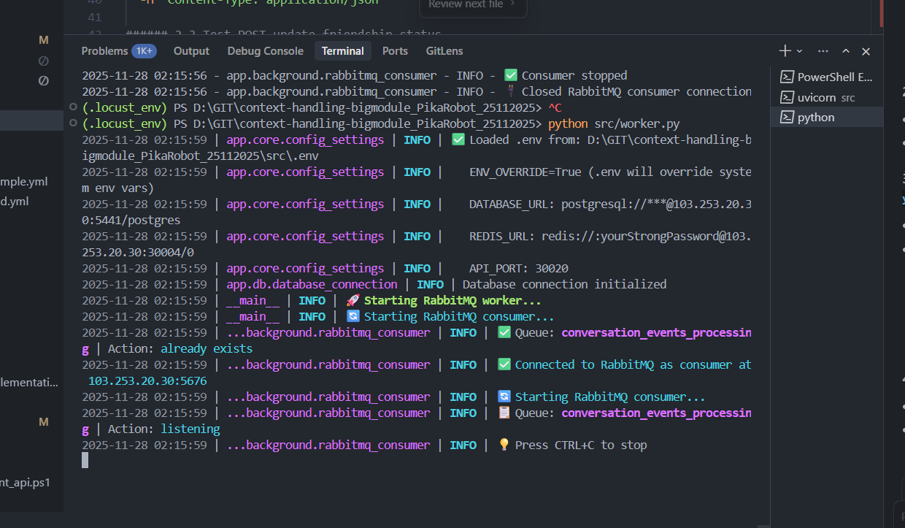

# 1. Lịch sử hình thành

# 2. Define từ đầu đến cuối = manus (hack time 2 tuần xuống 1 ngày là hiểu hết những thứ cần triển - thay vì đợt workflow refactor vừa làm vừa mò đường: thử sai refactor theo node 2 tuần, refactor lại riêng bỏ node và theo module nhỏ 1 tuần, fix logic 2 tuần => hơn 1 tháng. Thay vào đó nếu manus thì có thể move 1 ngày để define xong giải pháp best nhất và chỉ cần implement thôi)

3. Thứ 2 họp, Thứ 3 manus define tài liệu
4. Thứ 4 code 70-80%
5. Thứ 5 ghép thông luồng và 85% logic
6. OT ghép hoàn thiện

